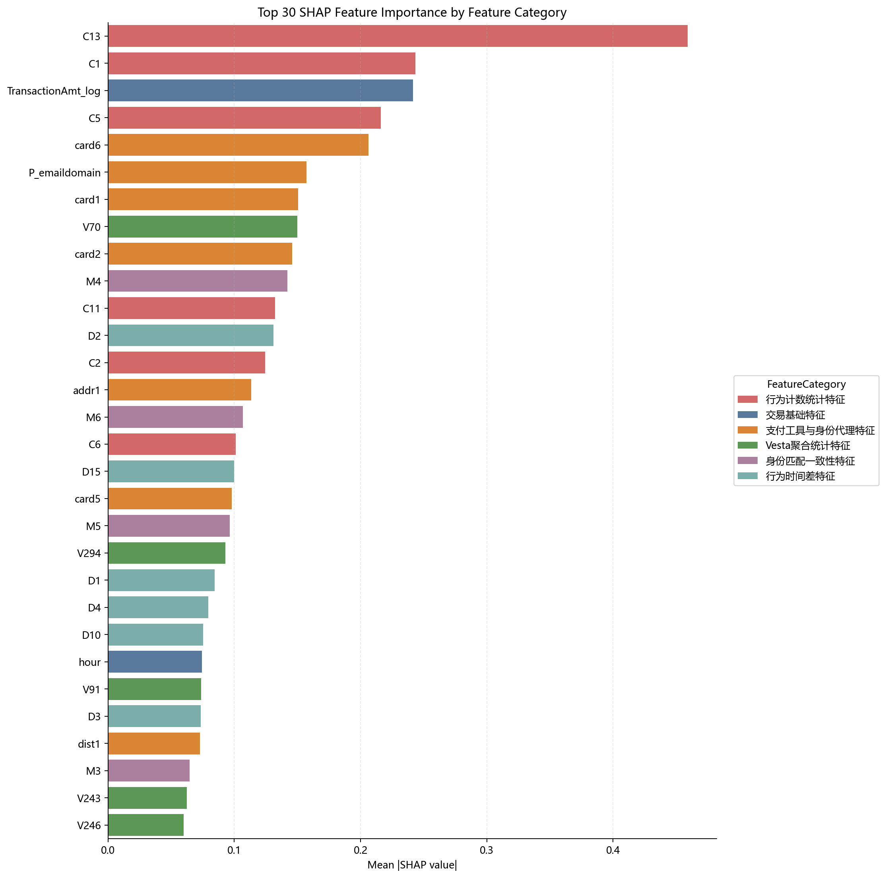
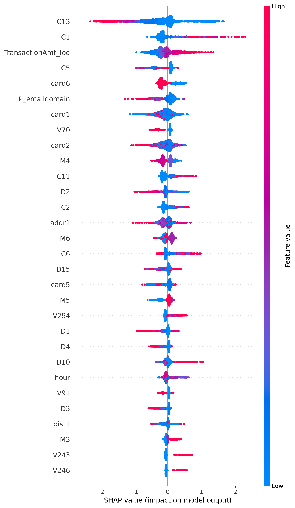
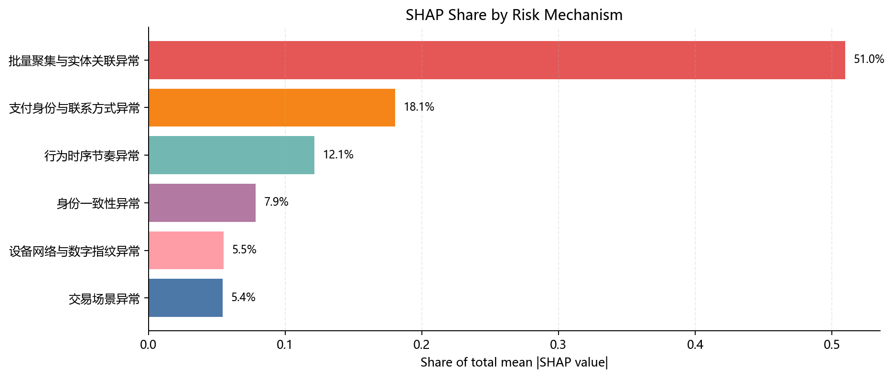
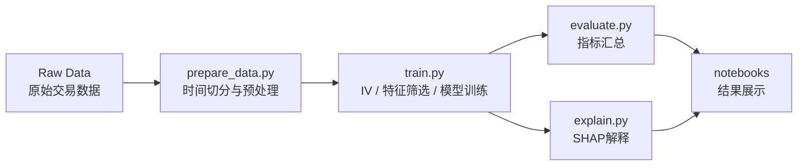

# 在线交易欺诈风险建模工程

本项目面向 **Online Transaction Fraud Risk Modeling** 场景，构建一套可复现、模块化、可解释的交易欺诈识别流程。项目重点不是单一 Notebook 实验，而是将数据处理、风险特征体系、WOE-IV 特征筛选、模型训练、评估与 SHAP 解释整合为一条工程化流水线。

项目使用公开在线交易欺诈数据进行实验验证，用于模拟真实交易风险识别场景。当前实验采用 IEEE-CIS Fraud Detection 数据。

## 项目价值

- 从交易、身份、设备、行为、关联等维度构建互联网风控特征体系。
- 使用 WOE-IV 方法识别有效风险信号，并设计多种特征筛选方案。
- 训练 WOE-LR、Random Forest、XGBoost 等模型，比较模型在时间切分数据上的泛化表现。
- 使用 AUC、PR-AUC、KS、F1、TopK Lift 等指标评估欺诈识别效果。
- 使用 TreeSHAP 将模型结果解释到特征和风险机制层面。
- 通过脚本、配置、测试和日志形成可复现的工程化流程。

## 风险特征体系

在线交易欺诈通常不是单一字段异常，而是多个字段组共同作用。本项目在代码中使用 `FeatureCategory` 和 `RiskMechanism` 两层标签描述风险信号，并在训练输出中保存对应的特征体系表，避免 README 中额外引入与代码口径不一致的分类。

### 字段分类与风险机制口径

本项目在代码中使用两层标签描述风险信号：`FeatureCategory` 表示字段在数据结构上的类别，`RiskMechanism` 表示该类字段在风控解释中的风险归因。第三张风险机制归因图正是按照 `RiskMechanism` 聚合 SHAP 贡献得到的。

| 字段分类 `FeatureCategory` | 字段范围 | 业务风险维度 | 风险机制 `RiskMechanism` | 解释口径 |
| --- | --- | --- | --- | --- |
| 交易基础特征 | `hour`、`TransactionAmt_log`、`ProductCD` | 交易风险 | 交易场景异常 | 相对交易时段、金额强度和商品类型等交易场景与正常交易模式不一致。 |
| 支付工具与身份代理特征 | `card1`-`card6`、`addr1`、`addr2`、`P_emaildomain`、`R_emaildomain`、`dist1`、`dist2` | 身份风险、关联风险 | 支付身份与联系方式异常 | 支付卡、地址、邮箱域名、距离代理字段等身份与联系方式信息携带风险差异。 |
| 行为计数统计特征 | `C1`-`C14` | 行为风险、关联风险 | 批量聚集与实体关联异常 | 同一实体或相近实体出现高频交易、集中交易、批量尝试等信号。 |
| Vesta 聚合统计特征 | `V1`-`V339` | 行为风险、关联风险 | 批量聚集与实体关联异常 | 匿名聚合统计字段反映复杂行为聚集、实体关联和历史统计差异。 |
| 行为时间差特征 | `D1`-`D15` | 行为风险 | 行为时序节奏异常 | 交易间隔、历史活跃周期或时间节奏与正常用户不一致。 |
| 身份匹配一致性特征 | `M1`-`M9` | 身份风险 | 身份一致性异常 | 交易身份信息之间的匹配关系异常，可能代表身份冒用或资料不一致。 |
| 设备网络与数字指纹特征 | `id_01`-`id_38`、`DeviceType`、`DeviceInfo` | 设备风险 | 设备网络与数字指纹异常 | 设备、浏览器、网络连接和数字指纹呈现异常组合；其中 `id_01`-`id_11` 按数值特征处理，`id_12`-`id_38` 按类别特征处理。 |
| 其他特征 | 未被上述规则覆盖的字段 | 其他 | 其他风险信号 | 暂未归入明确业务机制，只作为补充信号保留。 |

## Feature Dictionary

| 字段族 | 示例字段 | 风险维度 | 建模含义 | 处理方式 |
| --- | --- | --- | --- | --- |
| 交易金额与相对时段 | `TransactionAmt_log`、`hour` | 交易风险 | 捕捉金额强度和相对交易时段异常 | `TransactionDT` 只用于时间切分和派生 `hour`，`TransactionAmt` 只用于生成 `TransactionAmt_log`，二者不直接进入主候选字段 |
| 产品类型 | `ProductCD` | 交易风险 | 不同产品或交易场景可能具有不同欺诈率 | 类别编码、IV 分析 |
| 支付卡、地址与距离代理 | `card1`-`card6`、`addr1`、`addr2`、`dist1`、`dist2` | 身份风险、关联风险 | 反映支付工具、地理或账单地址代理信息，以及距离漂移带来的身份代理异常 | 类别编码、数值填充、WOE 编码、树模型编码 |
| 邮箱域名 | `P_emaildomain`、`R_emaildomain` | 身份风险 | 反映付款方和收款方联系方式风险 | 高频类别保留、低频合并 |
| 行为计数 | `C1`-`C14` | 行为风险、关联风险 | 捕捉实体计数、交易聚集和批量行为 | 数值填充、IV 筛选、SHAP 解释 |
| 时间差特征 | `D1`-`D15` | 行为风险 | 捕捉交易间隔、行为节奏和历史活跃差异 | 数值填充、IV 筛选 |
| 身份匹配 | `M1`-`M9` | 身份风险 | 反映交易身份信息的一致性 | 类别编码、WOE 编码 |
| Vesta 聚合字段 | `V1`-`V339` | 行为风险、关联风险 | 聚合统计和复杂行为信号 | 缺失率过滤、IV 筛选、树模型训练 |
| 设备与身份字段 | `id_01`-`id_38`、`DeviceType`、`DeviceInfo` | 设备风险 | 捕捉设备、浏览器、网络连接和数字指纹异常 | `id_01`-`id_11` 数值填充，`id_12`-`id_38` 与设备字段做类别编码，保留高缺失字段的缺失指示变量 |

候选字段采用数据字典驱动的风险字段体系，不直接把处理后数据表中的所有列放入模型。`TransactionDT` 用于时间切分和派生相对时段，`TransactionAmt` 用于生成 `TransactionAmt_log`，`relative_day` 作为时间位置辅助字段保留在预处理数据中，但不作为主建模候选字段。

相关代码位于：

```text
src/fraud_detection/features.py
```

主要输出表：

```text
outputs/tables/risk_feature_system.csv
outputs/iv_002_050/tables/model_feature_info.csv
outputs/iv_002_050/shap/shap_mechanism_summary.csv
```

## 主要实验结论

### 数据使用边界

本项目使用有标签交易样本，并按 `TransactionDT` 时间顺序切分为 Train、Valid、Test。由于官方所给测试集文件不含标签；README 中的 Test 指项目内部留出的时间后段测试集。

实验边界如下：

- Train：拟合预处理规则、WOE/IV、WOE-LR、Random Forest 和 XGBoost。
- Valid：用于 XGBoost early stopping、分类阈值选择、方案比较和业务取舍。
- Test：在方案和阈值固定后做最终留出评估，不参与训练、特征筛选、阈值选择或调参。

因此，下方测试集指标用于最终泛化检验，不是模型训练或反复选择方案的依据。

### 模型对比

当前结果显示，XGBoost 在各特征方案上的整体表现明显优于 WOE-LR 和 Random Forest。`iv_002_050 + XGBoost` 被作为主解释方案，原因不是它在所有指标上都最高，而是它在召回能力、风险机制解释和去除极端 IV 变量之间取得了较好的平衡。

XGBoost 在最终留出测试集上的主要结果如下：

| 特征方案 | AUC | PR-AUC | Precision | Recall | F1 | KS | 验证集 F1 阈值 | 结果解读 |
| --- | ---: | ---: | ---: | ---: | ---: | ---: | ---: | --- |
| `iv_ge_002` | 0.9003 | 0.5100 | 0.5412 | 0.4496 | 0.4911 | 0.6430 | 0.8143 | IV 下限筛选后保留更多变量，综合排序能力较强 |
| `iv_002_050` | 0.8983 | 0.5064 | 0.5074 | 0.4794 | 0.4930 | 0.6441 | 0.7950 | 主解释方案，Recall 最高，更适合召回优先的风控场景 |
| `iv_010_050` | 0.8885 | 0.4896 | 0.4923 | 0.4671 | 0.4794 | 0.6192 | 0.7742 | 更严格的 IV 下限会减少变量，但也损失部分排序能力 |
| `all_features` | 0.9008 | 0.5158 | 0.5665 | 0.4476 | 0.5001 | 0.6459 | 0.8202 | 全量特征对照方案，AUC、PR-AUC、Precision、F1 略高 |

从业务取舍看，`all_features` 更像综合性能上界对照，`iv_002_050` 更适合写作和展示为主方案：它排除了 IV 过低的弱信号和 IV 过高的潜在不稳定信号，同时保留了更好的欺诈召回。

### Top-K 风险排序

在人工审核资源有限的场景中，Top-K 排序比单一分类阈值更接近真实风控使用方式。各覆盖比例下，XGBoost 在测试集上的最优方案如下：

| 策略覆盖范围 | 最优方案 | Precision | 欺诈捕获率 | Lift | 策略含义 |
| --- | --- | ---: | ---: | ---: | --- |
| Top 1% | `all_features` | 0.8836 | 0.2536 | 25.39 | 极小审核队列时，全量特征排序最集中 |
| Top 3% | `all_features` | 0.5341 | 0.4603 | 15.34 | 小规模审核队列仍以全量特征略优 |
| Top 5% | `iv_ge_002` | 0.3843 | 0.5521 | 11.04 | 中等覆盖下，保留较多 IV 有效变量略占优 |
| Top 10% | `iv_002_050` | 0.2416 | 0.6941 | 6.94 | 覆盖扩大后，主方案的欺诈捕获率最高 |

这说明模型不仅可以做二分类判断，也适合用于风险排序、人工审核队列和分层处置策略。最终选择哪一套方案，应根据审核容量、误杀成本和召回优先级确定。

## 关键结果可视化

SHAP 特征重要性显示，`C13`、`C1`、`TransactionAmt_log`、`C5`、`card6`、`P_emaildomain`、`card1`、`V70`、`card2`、`M4` 等字段是主方案中的关键风险信号。



SHAP summary 图进一步展示了主要特征在不同取值下对欺诈预测方向的影响。



按风险机制汇总后的 SHAP 贡献可以用于风险归因，展示模型主要依赖哪些业务风险维度进行判断。



从风险机制汇总看，模型解释结果主要集中在：

| 风险机制 | SHAP 占比 | 特征数 | 解释性结论 |
| --- | ---: | ---: | --- |
| 批量聚集与实体关联异常 | 50.98% | 224 | 贡献占比最高，说明行为计数、Vesta 聚合统计和实体关联类特征是主要欺诈信号。 |
| 支付身份与联系方式异常 | 18.05% | 10 | 支付卡、邮箱、地址等身份代理字段对风险判断有明显贡献。 |
| 行为时序节奏异常 | 12.15% | 15 | 时间差和交易节奏能够反映异常行为模式。 |
| 身份一致性异常 | 7.85% | 9 | 身份匹配字段对识别资料不一致、身份冒用等风险有辅助作用。 |
| 设备网络与数字指纹异常 | 5.52% | 25 | 设备、网络和数字指纹字段提供环境层面的辅助风险信号。 |
| 交易场景异常 | 5.45% | 2 | 金额和交易场景字段虽然数量少，但单个特征解释强度较高。 |

## 风险评分与策略模块分析

当前项目已经具备风险评分和离线策略分析基础。模型输出的 `score` 可以理解为交易风险排序分，分数越高，模型认为欺诈风险越高。由于 XGBoost 使用了类别不平衡权重，当前 `score` 不应直接解释为已经校准的欺诈概率；如果要用于线上概率口径、授信规则或金额期望损失计算，需要额外做概率校准和线上回测。

预测分数文件位于：

```text
outputs/iv_002_050/predictions/xgboost_predictions.csv
```

其中核心字段包括：

- `y_true`：真实标签
- `score`：模型输出风险分
- `Split`：Train、Valid、Test 数据切分
- `Scheme`：实验方案
- `Model`：模型名称

可以基于 `score` 构建如下策略分层。下表使用主解释方案 `iv_002_050 + XGBoost` 在最终留出测试集上的 Top-K 排序结果：

| 策略层级 | 分层方式 | 离线表现参考 | 建议处置 |
| --- | --- | --- | --- |
| 极高风险 | Top 1% 风险分 | Precision 0.8768，捕获约 25.17% 欺诈，Lift 25.19 | 强拦截、人工复核、延迟履约、强验证 |
| 高风险 | Top 3% 风险分 | Precision 0.5322，捕获约 45.86% 欺诈，Lift 15.29 | 人工审核、二次认证、限制敏感操作 |
| 中风险 | Top 5% 风险分 | Precision 0.3800，捕获约 54.59% 欺诈，Lift 10.92 | 短信验证、设备校验、交易限额 |
| 观察风险 | Top 10% 风险分 | Precision 0.2416，捕获约 69.41% 欺诈，Lift 6.94 | 加强监控、进入灰名单、后验核查 |
| 低风险 | Top 10% 以外 | 风险排序较低 | 正常放行 |

也可以使用训练流程中在验证集上自动选择的分类阈值：

```text
score >= 0.7950
```

该阈值来自验证集 F1 最优点，并在方案固定后应用到最终留出测试集。对应测试集表现为：

- Precision：0.5074
- Recall：0.4794
- F1：0.4930

因此，本项目可以支持两类策略使用方式：

1. **阈值策略**：适合需要给出是否欺诈判断的场景，例如 `score >= 0.7950` 判为高风险。
2. **排序策略**：适合人工审核资源有限的场景，例如优先处理 Top 1%、Top 3%、Top 5% 的交易。

实际业务上线时，还需要结合误杀成本、审核能力、交易金额、用户等级和实时反馈数据重新校准阈值，并监控分数分布漂移。

## 项目设计

本项目采用模块化和配置化组织方式，便于复现实验、扩展模型和追踪结果。

```text
ieee-fraud-project/
├── configs/                 # 实验配置：base、xgb、rf、lr、woe_lr
├── data/
│   ├── raw/                 # 原始数据，不纳入版本控制
│   ├── interim/             # 中间数据
│   └── processed/           # 预处理后的 parquet 数据
├── docs/assets/             # README 展示图片
├── notebooks/               # EDA、特征探索、IV 分析、解释性展示
├── outputs/                 # 模型、指标、预测、SHAP、日志等输出
├── scripts/                 # 命令行入口脚本
├── src/fraud_detection/     # 核心 Python 包
├── tests/                   # 单元测试
├── pyproject.toml           # Python 包与测试配置
└── requirements*.txt        # 分层依赖文件
```

核心优势：

- **Modular pipeline**：数据、特征、IV、模型、评估、解释分别封装为模块。
- **Reproducible experiments**：通过 `configs/*.yaml` 固定实验参数。
- **Script-first workflow**：正式结果由脚本生成，Notebook 主要用于展示和复核。
- **Test coverage**：`tests/` 覆盖数据处理、特征映射、IV 计算和评估指标。
- **Traceable outputs**：训练过程写入 `outputs/logs/training.log`，结果统一保存在 `outputs/`。
- **Model-specific preprocessing**：WOE-LR 使用 TimeSeriesSplit 交叉验证 WOE 编码，降低训练集内部目标泄露风险，并通过近零方差、相关性和 VIF 过滤控制共线性；XGBoost 支持按训练集类别比例自动设置 `scale_pos_weight`。

## 项目流程



完整流程包括：

1. 环境准备
2. 数据放置与预处理
3. 探索性数据分析，即 EDA
4. 特征工程与风险特征体系构建
5. WOE-IV 分析与特征筛选
6. 模型训练：WOE-LR、Random Forest、XGBoost
7. 模型评估：AUC、PR-AUC、KS、Precision、Recall、F1、TopK Lift
8. 可解释性分析：TreeSHAP、特征重要性、风险机制汇总
9. Notebook 结果展示与分析

其中，特征筛选和预处理规则只在 Train 上拟合；XGBoost 的 early stopping、分类阈值和方案取舍参考 Valid；Test 只在最后用于留出评估和结果报告。

## 环境安装

进入项目目录：

```powershell
cd "D:\Vs code\ieee-fraud-project"
```

安装核心运行依赖：

```powershell
.\.venv\Scripts\python -m pip install -r requirements.txt
.\.venv\Scripts\python -m pip install -e .
```

如果需要运行测试，安装开发依赖：

```powershell
.\.venv\Scripts\python -m pip install -r requirements-dev.txt
```

如果需要运行 Notebook，安装 Notebook 依赖：

```powershell
.\.venv\Scripts\python -m pip install -r requirements-notebook.txt
```

## 数据准备

将原始交易数据 CSV 文件放在：

```text
data/raw/ieee-fraud-detection/
```

当前实验使用 IEEE-CIS Fraud Detection 数据格式，训练流程需要：

- `train_transaction.csv`
- `train_identity.csv`


## 标准运行流程

先运行单元测试，确认核心函数正常：

```powershell
.\.venv\Scripts\python -m pytest
```

生成按时间切分的 train、valid、test 数据：

```powershell
.\.venv\Scripts\python scripts/prepare_data.py --config configs/base.yaml
```

运行完整四方案实验：

```powershell
.\.venv\Scripts\python scripts/train.py --config configs/base.yaml
```

训练进度会输出到终端，并写入：

```text
outputs/logs/training.log
```

可以用下面命令持续查看训练日志：

```powershell
Get-Content outputs\logs\training.log -Wait
```

生成主方案 `iv_002_050` 的 SHAP 可解释性结果：

```powershell
.\.venv\Scripts\python scripts/explain.py --config configs/base.yaml --experiment iv_002_050
```

汇总主方案 `iv_002_050` 的评估指标：

```powershell
.\.venv\Scripts\python scripts/evaluate.py --config configs/base.yaml --experiment iv_002_050
```

## 快速训练

如果只想运行 XGBoost 相关方案，可以使用：

```powershell
.\.venv\Scripts\python scripts/train.py --config configs/xgb.yaml
```

## Notebook 使用方式

脚本负责生成正式实验结果，Notebook 主要用于交互式查看、分析和展示结果。

启动 Jupyter Lab：

```powershell
.\.venv\Scripts\python -m jupyter lab
```

在脚本流程完成后打开：

```text
notebooks/04_model_interpretation.ipynb
```

如果希望在命令行中执行 Notebook 并将结果输出到单独目录：

```powershell
New-Item -ItemType Directory -Force outputs\notebooks
.\.venv\Scripts\python -m jupyter nbconvert --to notebook --execute notebooks\04_model_interpretation.ipynb --output-dir outputs\notebooks
```

## 主要输出文件

- `outputs/tables/iv_summary.csv`：IV 汇总表
- `outputs/tables/risk_feature_system.csv`：风险特征体系表
- `outputs/tables/experiment_scheme_summary.csv`：实验方案汇总
- `outputs/tables/all_metrics_train_valid_test.csv`：Train、Valid、Test 指标汇总
- `outputs/tables/all_topk_train_valid_test_with_lift.csv`：TopK 捕获率与 Lift 结果
- `outputs/<scheme>/models/*.joblib`：模型文件
- `outputs/<scheme>/metrics/*.csv`：单方案模型评估指标
- `outputs/<scheme>/predictions/*.csv`：预测分数
- `outputs/<scheme>/tables/woe_filter_summary.json`：WOE-LR 特征过滤汇总
- `outputs/<scheme>/tables/woe_filter_detail.csv`：WOE-LR 近零方差、相关性和 VIF 删除明细
- `outputs/<scheme>/tables/woe_vif_report.csv`：WOE-LR VIF 迭代过滤报告
- `outputs/<scheme>/shap/*.csv`：SHAP 解释性结果表
- `outputs/<scheme>/shap/*.png`：SHAP 可视化图片

其中 `<scheme>` 表示实验方案，例如：

- `iv_ge_002`
- `iv_002_050`
- `iv_010_050`
- `all_features`

## 重新运行项目

若只需要重新训练和解释模型，清空：

```text
outputs/
```

若想从数据预处理开始完全重跑，同时清空：

```text
data/processed/
outputs/
```

不要删除：

```text
data/raw/
```

`data/raw/` 中保存的是原始数据文件。
