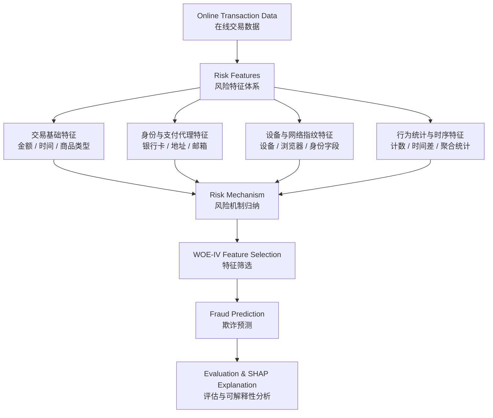
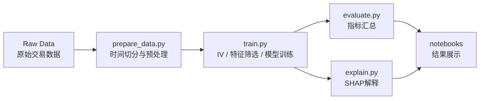

# 在线交易欺诈风险建模工程

本项目面向 **Online Transaction Fraud Risk Modeling** 场景，构建一套可复现、模块化、可解释的交易欺诈识别流程。项目重点不是单一 Notebook 实验，而是将数据处理、风险特征体系、WOE-IV 特征筛选、模型训练、评估与 SHAP 解释整合为一条工程化流水线。

项目当前使用 IEEE-CIS Fraud Detection 数据作为实验数据来源，用于模拟在线交易中的欺诈风险识别任务。

## 项目目标

- 构建面向在线交易场景的风险特征体系。
- 使用 WOE-IV 方法进行特征筛选与风险信号识别。
- 训练 WOE-LR、Random Forest、XGBoost 等模型，并比较不同特征方案的效果。
- 通过 AUC、PR-AUC、KS、F1、TopK Lift 等指标评估模型表现。
- 使用 TreeSHAP 分析模型判断依据，形成可解释的风险机制结论。
- 将研究流程工程化，支持脚本化复现、配置化实验和 Notebook 展示。

## 风险建模思路

本项目将原始交易字段组织为风险特征体系，再通过 IV、模型表现和 SHAP 解释分析风险信号与欺诈预测之间的关系。



在代码中，风险体系主要体现在：

- `FeatureCategory`：特征类别，例如交易基础特征、身份代理特征、设备网络特征、行为统计特征。
- `RiskMechanism`：风险机制，例如交易场景异常、身份一致性异常、设备网络异常、批量聚集异常。

相关逻辑位于：

```text
src/fraud_detection/features.py
```

## 工程化设计

本项目采用模块化和配置化组织方式，便于复现实验、扩展模型和追踪结果。

```text
ieee-fraud-project/
├── configs/                 # 实验配置：base、xgb、rf、lr、woe_lr
├── data/
│   ├── raw/                 # 原始数据，不纳入版本控制
│   ├── interim/             # 中间数据
│   └── processed/           # 预处理后的 parquet 数据
├── notebooks/               # EDA、特征探索、IV 分析、解释性展示
├── outputs/                 # 模型、指标、预测、SHAP、日志等输出
├── scripts/                 # 命令行入口脚本
├── src/fraud_detection/     # 核心 Python 包
├── tests/                   # 单元测试
├── pyproject.toml           # Python 包与测试配置
└── requirements*.txt        # 分层依赖文件
```

核心优势：

- **Modular pipeline**：数据、特征、IV、模型、评估、解释分别封装为模块。
- **Reproducible experiments**：通过 `configs/*.yaml` 固定实验参数。
- **Script-first workflow**：正式结果由脚本生成，Notebook 主要用于展示和复核。
- **Test coverage**：`tests/` 覆盖数据处理、特征映射、IV 计算和评估指标。
- **Traceable outputs**：训练过程写入 `outputs/logs/training.log`，结果统一保存在 `outputs/`。

## 项目流程



完整流程包括：

1. 环境准备
2. 数据放置与预处理
3. 探索性数据分析，即 EDA
4. 特征工程与风险特征体系构建
5. WOE-IV 分析与特征筛选
6. 模型训练：WOE-LR、Random Forest、XGBoost
7. 模型评估：AUC、PR-AUC、KS、Precision、Recall、F1、TopK Lift
8. 可解释性分析：TreeSHAP、特征重要性、风险机制汇总
9. Notebook 结果展示与论文分析

## 环境安装

进入项目目录：

```powershell
cd "D:\Vs code\ieee-fraud-project"
```

安装核心运行依赖：

```powershell
.\.venv\Scripts\python -m pip install -r requirements.txt
.\.venv\Scripts\python -m pip install -e .
```

如果需要运行测试，安装开发依赖：

```powershell
.\.venv\Scripts\python -m pip install -r requirements-dev.txt
```

如果需要运行 Notebook，安装 Notebook 依赖：

```powershell
.\.venv\Scripts\python -m pip install -r requirements-notebook.txt
```

## 数据准备

将原始交易数据 CSV 文件放在：

```text
data/raw/ieee-fraud-detection/
```

当前实验使用 IEEE-CIS Fraud Detection 数据格式，训练流程至少需要：

- `train_transaction.csv`
- `train_identity.csv`

官方测试集文件是可选的：

- `test_transaction.csv`
- `test_identity.csv`
- `sample_submission.csv`

## 标准运行流程

先运行单元测试，确认核心函数正常：

```powershell
.\.venv\Scripts\python -m pytest
```

生成按时间切分的 train、valid、test 数据：

```powershell
.\.venv\Scripts\python scripts/prepare_data.py --config configs/base.yaml
```

运行完整四方案实验：

```powershell
.\.venv\Scripts\python scripts/train.py --config configs/base.yaml
```

训练进度会输出到终端，并写入：

```text
outputs/logs/training.log
```

可以用下面命令持续查看训练日志：

```powershell
Get-Content outputs\logs\training.log -Wait
```

生成主方案 `iv_002_050` 的 SHAP 可解释性结果：

```powershell
.\.venv\Scripts\python scripts/explain.py --config configs/base.yaml --experiment iv_002_050
```

汇总主方案 `iv_002_050` 的评估指标：

```powershell
.\.venv\Scripts\python scripts/evaluate.py --config configs/base.yaml --experiment iv_002_050
```

## 快速训练

如果只想运行 XGBoost 相关方案，可以使用：

```powershell
.\.venv\Scripts\python scripts/train.py --config configs/xgb.yaml
```

## Notebook 使用方式

脚本负责生成正式实验结果，Notebook 主要用于交互式查看、分析和展示结果。

启动 Jupyter Lab：

```powershell
.\.venv\Scripts\python -m jupyter lab
```

建议在脚本流程完成后打开：

```text
notebooks/04_model_interpretation.ipynb
```

如果希望在命令行中执行 Notebook 并将结果输出到单独目录：

```powershell
New-Item -ItemType Directory -Force outputs\notebooks
.\.venv\Scripts\python -m jupyter nbconvert --to notebook --execute notebooks\04_model_interpretation.ipynb --output-dir outputs\notebooks
```

## 主要输出文件

- `outputs/tables/iv_summary.csv`：IV 汇总表
- `outputs/tables/risk_feature_system.csv`：风险特征体系表
- `outputs/tables/experiment_scheme_summary.csv`：实验方案汇总
- `outputs/tables/all_metrics_train_valid_test.csv`：Train、Valid、Test 指标汇总
- `outputs/tables/all_topk_train_valid_test_with_lift.csv`：TopK 捕获率与 Lift 结果
- `outputs/<scheme>/models/*.joblib`：模型文件
- `outputs/<scheme>/metrics/*.csv`：单方案模型评估指标
- `outputs/<scheme>/predictions/*.csv`：预测分数
- `outputs/<scheme>/shap/*.csv`：SHAP 解释性结果表
- `outputs/<scheme>/shap/*.png`：SHAP 可视化图片

其中 `<scheme>` 表示实验方案，例如：

- `iv_ge_002`
- `iv_002_050`
- `iv_010_050`
- `all_features`

## 重新运行项目

如果只想重新训练和解释模型，可以清空：

```text
outputs/
```

如果想从数据预处理开始完全重跑，可以同时清空：

```text
data/processed/
outputs/
```

不要删除：

```text
data/raw/
```

`data/raw/` 中保存的是原始数据文件。
